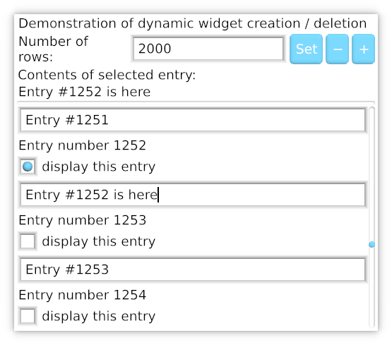

KAS GUI
==========

[](https://github.com/kas-gui/kas/actions)
[](https://github.com/kas-gui/kas)
[](https://gitlab.com/dhardy/kas)
[](https://docs.rs/kas)


KAS, the *toolKit Abstraction System*, is a general-purpose GUI toolkit.

Examples
---------

For details, see the [Examples README](kas-wgpu/examples/README.md).

 
 


Goals and status
------

**Goals** of the project and *current status* are:

-   Fully-functional, intuitive GUIs
-   Support stand-alone and embedded GUIs (*only stand-alone is functional*)
-   Support GPU-accelerated and CPU-only draw backends (*only GPU-accelerated is functional*)
-   Custom widgets in user code with high- and low-level draw APIs *and* raw backend access (*fully functional*)
-   Scalable to huge numbers of widgets (*partially realised: the dynamic example can run with >1'000'000 widgets but with some delays*)
-   Concise, expressive specification within code (*partially realised via macros which push Rust to its limits*)
-   User-customisable (*supports themes and colour schemes*)
-   Desktop integration (*not yet realised*)


### Rustc version

KAS is compatible with **stable rustc**. Using nightly Rust is advantageous:

-   Proceedural macros emit better diagnostics. In some cases, diagnostics are
    missed without nightly rustc, hence **nightly is recommended for development**.
-   A few other minor features are nightly-only. See *feature flags*
    documentation below and in other crates' READMEs.

### Code stability

KAS is young and incomplete, yet has a reasonably robust core framework. Users
should expect breaking changes when upgrading from one release to the next.

The draw APIs saw a big overhaul in version 0.3, but may well need further
revision. Text APIs are currently just placeholders. There is no translation
support, persistent configuration or desktop integration.

The widget traits, macros and, event model have seen significant changes in 0.4.
These will be extended in the future but hopefully only minor breaking changes
will be needed.

### Features

-   Persistent widgets with embedded state
-   Simple ownership model (no persistent pointers into widget state)
-   Type-safe user-defined event handlers
-   Robust event handling model
-   Extensive support for keyboard and touch-screen control
-   Disabled and error states for widgets
-   Scalable (HiDPI) supporting fractional scaling
-   Theme API, simple draw API and raw graphics access
-   Automatic widget layout including grids with spans and width-for-height sizing

### Missing features

These aren't here yet!

-   Text editing (currently only very basic support)
-   Raster graphics
-   Flow-box layouts


Installation and dependencies
----------------

Currently, KAS's only drawing method is [WebGPU](https://github.com/gfx-rs/wgpu-rs),
which requires DirectX 11/12, Vulkan or Metal.
In the future, there may be support for OpenGL and software rendering.

If you haven't already, install [Rust](https://www.rust-lang.org/), including
the *nightly* channel (`rustup toolchain install nightly`). Either make nightly
the default (`rustup default nightly`) or use `cargo +nightly ...` below.

A few other dependencies may require installation, depending on the system.
On Ubuntu:

```sh
sudo apt-get install build-essential git cmake libxcb-shape0-dev libxcb-xfixes0-dev
```

Next, clone the repository and run the examples as follows:

```
git clone https://github.com/kas-gui/kas.git
cd kas
cargo test
cd kas-wgpu
cargo test
cargo run --example gallery
```

### Crates

-   `kas`: the *core* of the GUI library, providing most interfaces and logic
    along with a selection of common widgets
-   `kas-macros`: a helper crate providing the procedural macros used by `kas`
-   `kas-theme`: theming support for KAS (API plus a couple of standard themes,
    at least for now)
-   `kas-wgpu`: provides windowing via [`winit`] and rendering via [`wgpu`]
-   `kas-widgets`: (unrealised) - providing extra widgets
-   `kas-graphs`: (unrealised) - plotting widgets

A user depends on `kas` to write their complete UI specification, and then
pastes a few lines of code to initialise `kas_wgpu::Toolkit`, choose a theme,
add window(s), and run the UI.

[`winit`]: https://github.com/rust-windowing/winit/
[`wgpu`]: https://github.com/gfx-rs/wgpu-rs

### Feature flags

The `kas` crate has the following feature flags:

-   `internal_doc`: turns on some extra documentation intended for internal
    usage but not for end users. (This only affects documentation.)
-   `nightly`: enables `new_uninit` feature to support cloning of
    `Box<dyn Handler>` objects
-   `winit`: adds compatibility code for winit's event and geometry types.
    This is currently the only functional windowing/event library.
-   `stack_dst`: some compatibility impls (see `kas-theme`'s documentation)


Copyright and Licence
-------

The [COPYRIGHT](COPYRIGHT) file includes a list of contributors who claim
copyright on this project. This list may be incomplete; new contributors may
optionally add themselves to this list.

The KAS library is published under the terms of the Apache License, Version 2.0.
You may obtain a copy of this licence from the [LICENSE](LICENSE) file or on
the following webpage: <https://www.apache.org/licenses/LICENSE-2.0>
